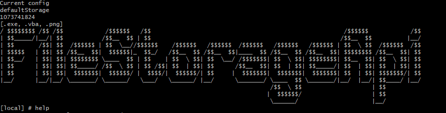
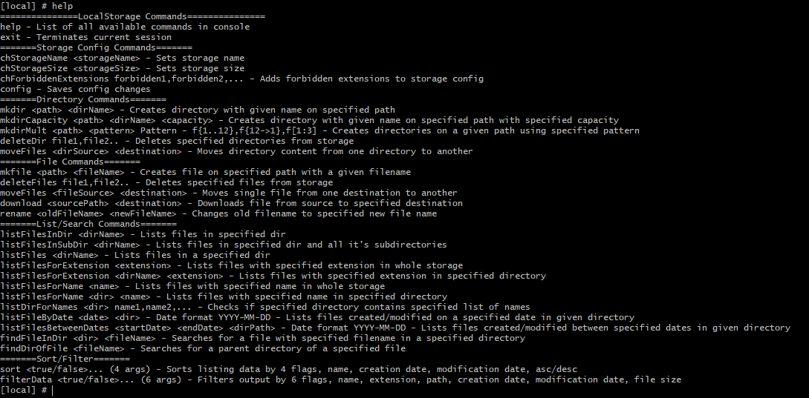

# FileStorageConsole
Console application for managing local or google file storage.

Run with: java -jar <name_of_compiled.jar> <local_storage/google_storage> <local_path/google_drive_id>

Use help command to print all options including descriptions

